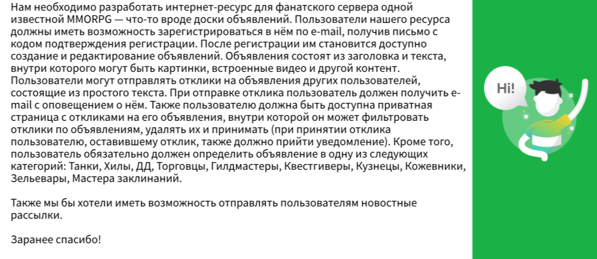
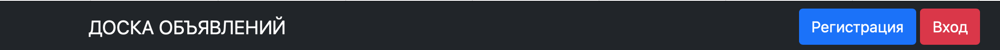
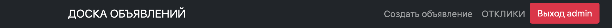
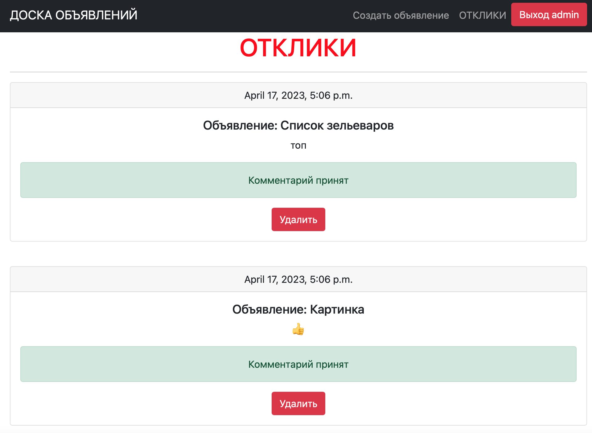
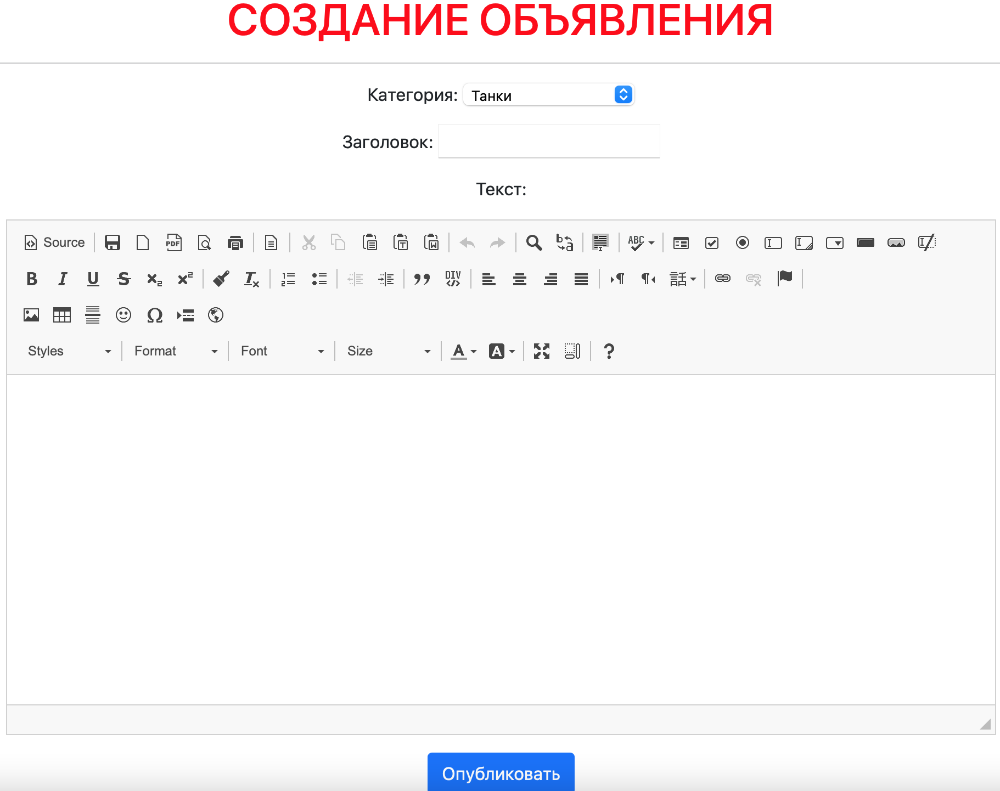

Привет, меня зовут **Алина** 👋

Учусь на курсе  
**Fullstack разработчик на Python**
 

Это итоговый проект по блоку **Backend-разработка**
# [Доска объявлений](http://127.0.0.1:8003/ad/)
[](https://git.io/typing-svg)

---
Задание:



Проект:


### Структура сайта:


1. Для незарегистрированных пользователей доступны страница со всеми объявлениями и регистрация

   
    
2. Для зарегистрированных пользователей доступны просмотр,создание, редактирование обьявлений, а также просмотр/принятие/удаление комментариев от других пользователей на собственные объявления


   



3. При помощи ```ckeditor``` при создание своего обьявления есть возможность добавить медиа-файл 


4. На главной странице организован поиск 

   
---
## 🔧Технические детали🔩 

Проект вполне стандартный, из особенностей  - применение ```` allauth```` (позволяет проводить регистрацию пользователей на сайте) и ```` ckeditor```` (позволяет форматировать обьявление, вставлять медиафайлы в объявление)


Cоответсвенно в ````settings.py```` указываем:
```` 
INSTALLED_APPS = [
    'django.contrib.admin',
    'django.contrib.auth',
    'django.contrib.contenttypes',
    'django.contrib.sessions',
    'django.contrib.messages',
    'django.contrib.staticfiles',
    'django.contrib.sites',
    'django.contrib.flatpages',
    'postboard.apps.PostboardConfig',

    'fpages',
    'django_filters',

    'allauth',
    'allauth.account',
    'allauth.socialaccount',
    'allauth.socialaccount.providers.yandex',

    'ckeditor',
    'ckeditor_uploader',
]

...........

CKEDITOR_CONFIGS = {
    'default': {
        'toolbar': 'full',
        'height': 300,
        'width': 900,
        'image2_responsive': True,
        'image2_maxWidth': 500,
    },
}
............

CKEDITOR_BASEPATH = "/static/ckeditor/ckeditor/"

CKEDITOR_UPLOAD_PATH = 'media/'

MEDIA_ROOT = 'media/'

MEDIA_URL = '/media/'

CKEDITOR_FILENAME_GENERATOR = 'utils.get_filename'

..............

ACCOUNT_EMAIL_REQUIRED = True
ACCOUNT_UNIQUE_EMAIL = True
ACCOUNT_USERNAME_REQUIRED = False
ACCOUNT_AUTHENTICATION_METHOD = 'email'
ACCOUNT_EMAIL_VERIFICATION = 'mandatory'


EMAIL_BACKEND = 'django.core.mail.backends.console.EmailBackend'
EMAIL_HOST = 'smtp.yandex.ru'
EMAIL_PORT = 465
EMAIL_HOST_USER = "__________"
EMAIL_HOST_PASSWORD = "----------"
EMAIL_USE_TLS = False
EMAIL_USE_SSL = True

DEFAULT_FROM_EMAIL = "_____________"
SERVER_EMAIL = "__________"

 ````
---
## Ознакомиться ➡️  [Документация allauth](https://django-allauth.readthedocs.io/en/latest/)

Ознакомиться ➡️  [Документация ckeditor](https://django-ckeditor.readthedocs.io/en/latest/)
-------


----
```` Спасибо за уделенное время! 🙏 ````

___


[](https://github.com/anuraghazra/github-readme-stats)